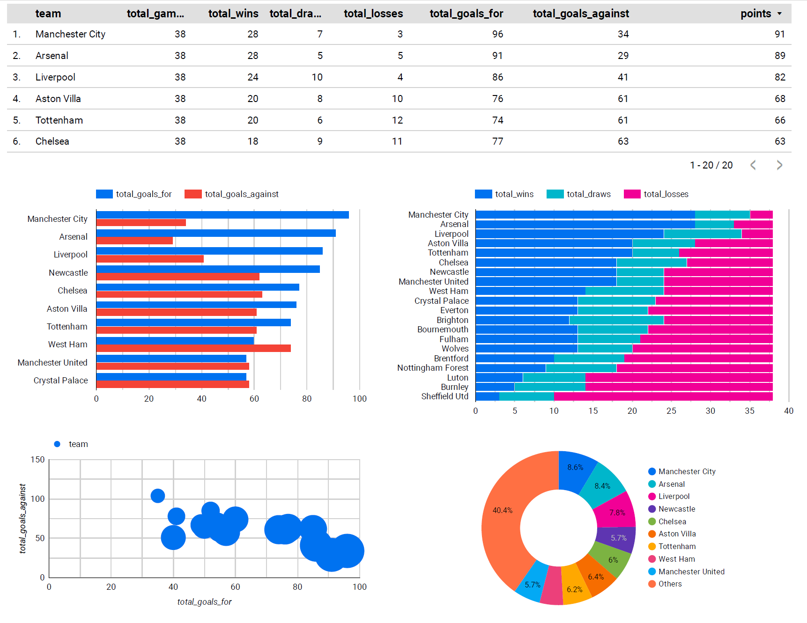

This project demonstrates a data engineering pipeline that extracts football match data from API-FOOTBALL, loads it into Google BigQuery, transforms it using dbt, and visualizes the results using Google Data Studio.

## Architecture

1. Data Extraction: Python script using requests to fetch data from API-FOOTBALL
2. Data Loading: Google Cloud BigQuery for data storage
3. Data Transformation: dbt for data modeling and transformation
4. Data Visualization: Google Data Studio for creating dashboards

## Setup

1. Clone this repository
2. Set up a Google Cloud Platform account and create a new project
3. Enable the BigQuery API and create a service account with BigQuery Admin access
4. Save the service account key as `service_account_key.json` in the project root
5. Sign up for API-FOOTBALL on RapidAPI and get your API key
6. Set up a Python virtual environment: `python -m venv venv`
7. Activate the virtual environment:
   - Windows: `venv\Scripts\activate`
   - Unix or MacOS: `source venv/bin/activate`
8. Install requirements: `pip install dbt-bigquery python-dotenv pandas requests google-cloud-bigquery`
9. Create a `.env` file with the following contents:
   ```
   API_FOOTBALL_KEY=your_api_key_here
   GCP_PROJECT_ID=your_gcp_project_id_here
   ```
10. Set up dbt profile in `~/.dbt/profiles.yml`

## Usage

1. Run data extraction and loading: `python extract_data.py`
2. Run dbt models: 
   ```
   cd football_dbt
   dbt run
   dbt test
   ```
3. Set up a Google Data Studio dashboard connecting to your BigQuery dataset

## dbt Models

- `team_performance`: Aggregates team statistics from match data

## Looker Visualisations

### 2023 English Premier League Team Performances


## License

[MIT](https://choosealicense.com/licenses/mit/)
